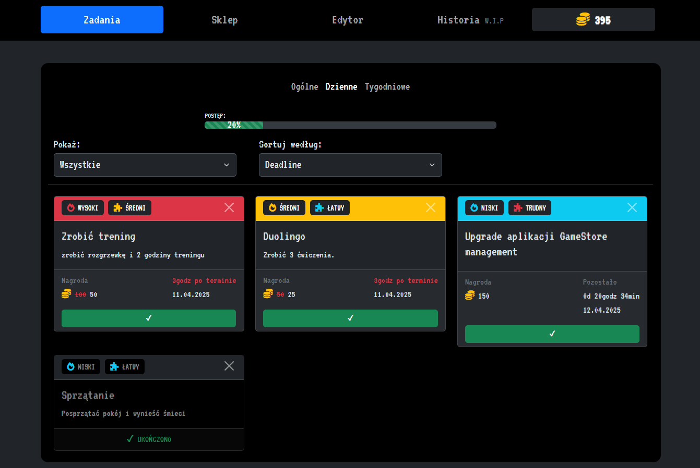
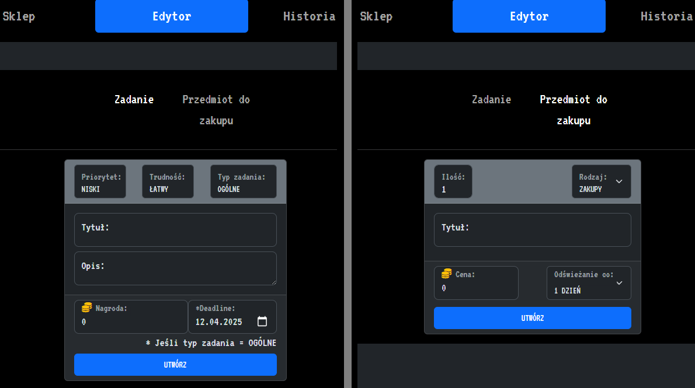
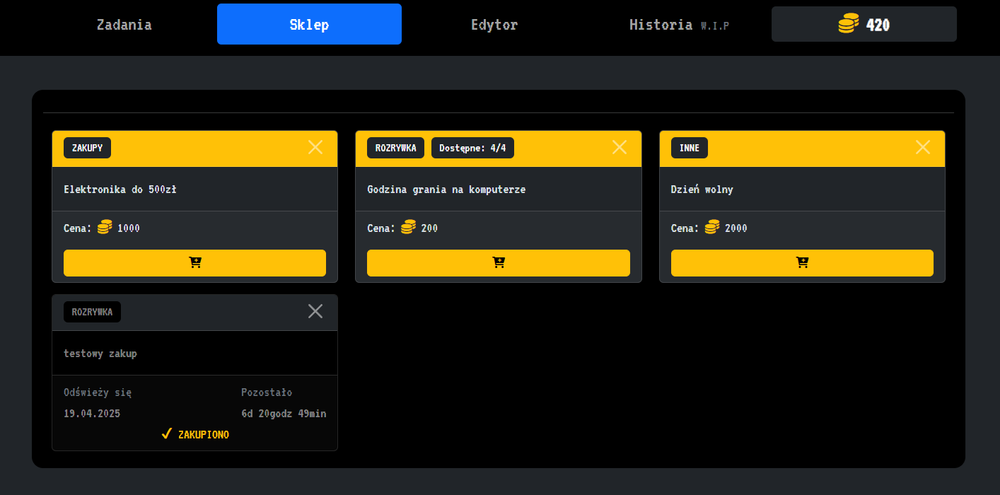
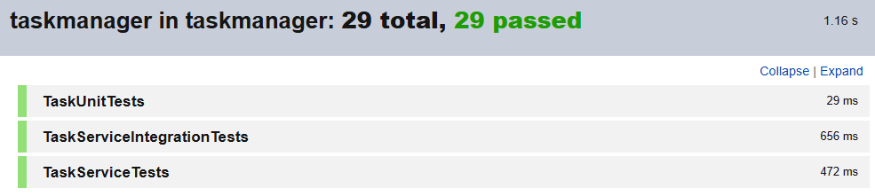

# Gamified Task Manager
### Główne założenia aplikacji
Użytkownik zbiera monety za wykonane zadania i następnie może je wymieniać na przedmioty w sklepie. Aplikacja ma pomóc w efektywnym dysponowaniu czasem i zwiększać wydajność użytkownika.

Użytkownik ma pełną kontrolę nad ekonomią aplikacji, to on tworzy zadania i przedmioty w sklepie.
#
### Wykorzystane technologie
- Spring Web
- Spring Data JPA
- JUnit 5
- Bazy danych: H2 do testów, MySQL do aplikacji
- DevTools
- Frontend: HTML, Bootstrap 5, Thymeleaf

Backend aplikacji został wykonany w całości przeze mnie. Jedynie przy korzystaniu z Bootstrap wspomagałem się częściowo internetem.

### Struktura aplikacji
- **Kontrolery**: EditorController, ShopController, TaskController.
- **Klasy**: Task, ShopItem, User, RemainingTime.
- **Enumy**: Difficulty, Priority, ShopItemType, Status, TaskType.
- **Serwisy**: TaskService, ShopItemService, UserService.
- **Repozytoria**: TaskJpaRepository, ShopItemJpaRepository, UserJpaRepository *(wszystkie interfejsy rozszerzają JpaRepository)*.
- **Klasy wyjątków**: ShopItemNotFoundException, TaskNotFoundException.
- **Szablony**: editor.html, shop.html, tasks.html, general.html *(zbiór fragmentów)*.
#
### Zadania
- Zadania mają:
    - **PRIORYTET**: niski, średni, wysoki.
    - **POZIOM TRUDNOŚCI**: łatwy, średni, trudny.
- Zadania mogą być ukończone lub usunięte
- Podział na zadania ogólne, dzienne, tygodniowe
- Zadania mogą być filtrowane i sortowane
- Aktywne po terminie
    - mają nagrodę zmniejszoną o 2x,
    - nie są odświeżane
- Ukończone
    - są odświeżone o ilość dni określoną przez typ zadania

#

#
### Edytor
Obecnie edytor pełni rolę kreatora zadań i przedmiotów. W przyszłości będzie to rozwinięte do edytowania aktualnych zadań i przedmiotów.

Po lewej **Edytor zadań**, po prawej **Edytor przedmiotów**.

#
### Sklep
- Przedmioty w sklepie mają:
    - **KATEGORIE**: zakupy, rozrywka, inne.
    - określoną ilość do wykorzystania *(gdy jest więcej niż 1 to wyświetla się tekst z informacją o dostępności)*.
- Przedmioty w sklepie mogą być kupione lub usunięte

Przy zakupie przedmiotu sprawdzana jest jego dostępność i czy ilość monet na koncie użytkownika jest taka sama lub większa niż cena przedmiotu.

### Testy
- W aplikacji zastosowano testy jednostkowe i integracyjne.
- Do testowania serwisów stosowano mocki i stuby.
- Przy pisaniu testów stosowano wzorzec testowania AAA.
- W testach integracyjnych używano bazy danych H2.

### TODO
- Dodanie w zakładce Historia logów odnośnie zakupionych przedmiotów, wykonanych zadań oraz dodanie statystyk i porównania wydajności użytkownika na przestrzeni określonego czasu.
- Dodanie Spring Security i możliwości założenia konta. Obecnie aplikacja korzysta ze sztywno zapisanego użytkownika bazie danych.
- Dodanie testów kontrolera.
- Zmiana listy rozwijanej "Pokaż" w zadaniach na filtrowanie z wielokrotnym wyborem.
- Dodanie walidacji w Edytorze z pomocą Spring Validation.